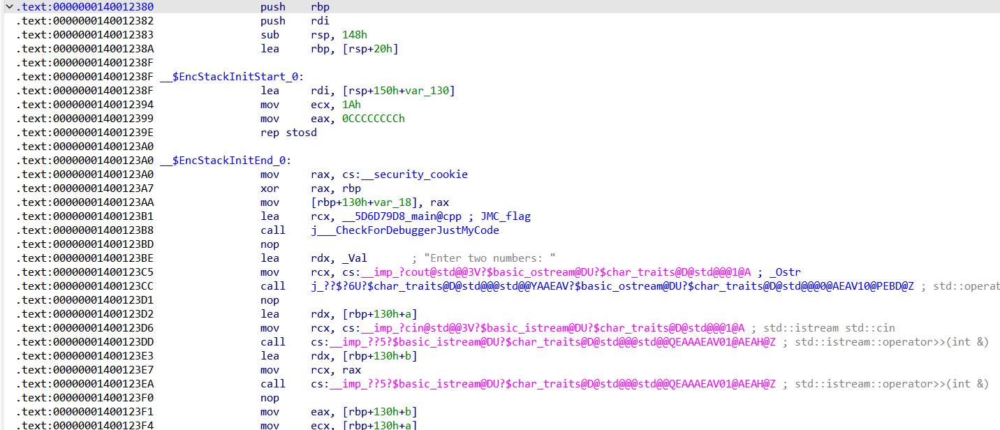
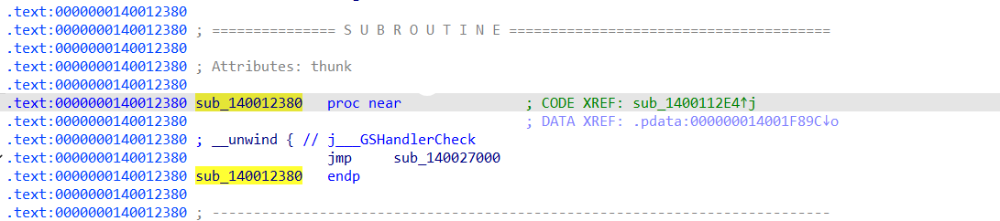
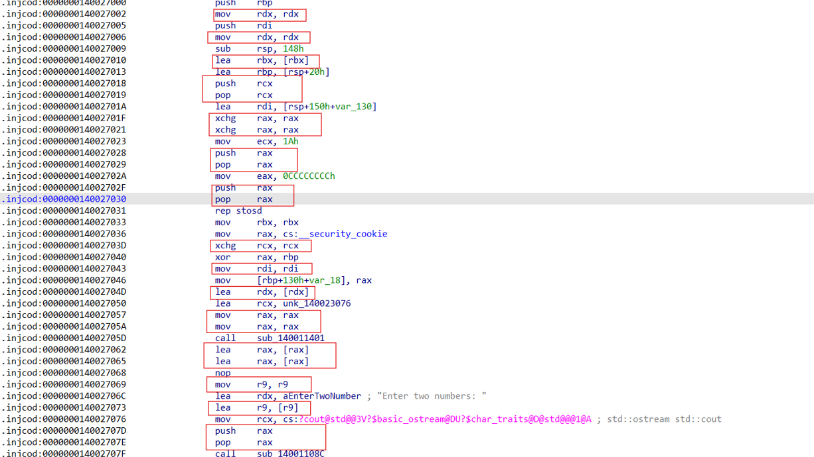

# ObfuGuard

## REQUIREMENT
- Library: asmjit, zydis, keystone, capstone, lief

```bash
vcpkg install capstone:x64-windows
vcpkg install keystone:x64-windows
vcpkg install lief:x64-windows
vcpkg install asmjit:x64-windows
vcpkg install zydis:x64-windows
```

- File Pe và file pdb của chương trình cần obfuscate.


## Control Flow Flattening


### Technique

- Duyệt qua tất cả các câu lệnh của hàm để tạo các block. Các block được xây dựng bắt đầu từ các điểm đích từ các lệnh conditional jump. Kết thúc của các block sẽ là các điểm kết thúc tự nhiên: hoặc là một lệnh jump và không call hàm, hoặc là 1 lệnh ret, hoặc là 1 điểm đích từ các lệnh conditional jump.

- Duyệt qua tất cả các block, câu lệnh cuối của block là lệnh conditional jump thì đặt vị trí của khối mà lệnh conditional jump kia nhảy tới vào block_dst. Đặt attribute next_block của block hiện tại bằng current_block_id+1.

- Shuffle vector chứa các block. Sử dụng rax là biến trạng thái để chuyển luồng qua dispatcher và tạo cấu trúc điều khiển thực hiện làm phẳng luồng.


### PoC


- Trước khi được làm phẳng, hàm có cấu trúc luồng cơ bản như trên: A->B or C -> D. Mục tiêu của việc làm phẳng luồng này là tạo ra cấu trúc điều khiển chuyển luồng giữa các block A,B,C,D thông qua dispatcher thay vì các thực thi luồng tuyến tính như ban đầu mà hiệu quả không đổi. Mục tiêu cần đạt được cần như sau:


- Sau khi thực hiện làm phẳng luồng, tải toàn bộ file pe thu được vào phần mềm  IDA để kiểm tra kết quả.


- Dựa vào Control-flow graph thu được, cấu trúc của chương trình đã bị biến đổi thông qua biến trạng thái là thanh ghi rax, và chuyển đổi luồng liên tục thông qua các lệnh `cmp eax,0`, `cmp eax,2`, `cmp eax,3`, `cmp eax,1`. Truy vết theo các luồng ứng với eax thì dẫn đến các đoạn block A, block B, Block C, Block D như mong đợi.


- Tiếp tục kiểm chứng hiệu quả chương trình thông qua mã pseudocode thu được khi decompile:

```C
__int64 __fastcall sub_1400292F5(char a1)
{
  __int64 v5; // rax
  _QWORD *v6; // rbp
  __int64 v7; // rdi
  int v8; // eax
  _QWORD v15[26]; // [rsp-D0h] [rbp-1A8h] BYREF
  __int64 v16; // [rsp+0h] [rbp-D8h]
  char v17; // [rsp+10h] [rbp-C8h]

  v16 = v5;
  __asm { pushf }
  v8 = 0;
  while ( 1 )
  {
    while ( v8 == 2 )
    {
      __asm { popf }
      v16 = sub_140011217();
      __asm { pushf }
      v8 = 3;
    }
    if ( v8 )
      break;
    __asm { popf }
    v17 = a1;
    v16 = (__int64)v6;
    v15[25] = v7;
    v6 = v15;
    ((void (__fastcall *)(void *))sub_1400113F7)(&unk_140023076);
    ((void (__fastcall *)(_QWORD, const char *))sub_140011087)(std::cout, "Block A\n");
    _CF = 0;
    _OF = 0;
    _ZF = v17 == 0;
    _SF = 0;
    if ( v17 )
    {
      __asm { pushf }
      v8 = 1;
    }
    else
    {
      __asm { pushf }
      v8 = 2;
    }
  }
  if ( v8 == 3 )
  {
    __asm { popf }
    return v16;
  }
  else
  {
    __asm { popf }
    return sub_1400112C1();
  }
}
```
 
- Dựa vào pseudocode thu được, cấu trúc của chương trình cũng dễ dàng nhận thấy sự thay đổi. Với biến trạng thái v8 (biểu thị của rax), các câu lệnh if kiểm tra các giá trị của biến trạng thái để chuyển luồng vào block A, sub_1400112c1 (), sub_140011217() và return. Khi truy vết theo luồng này thì thu được kết quả là cấu trúc này của chương trình thực hiện chuyển luồng qua biến v8 tới các block A, block B, block C, block D như mong đợi.


## Junk Code Injection
### Techique

- Background technique - Trampoline:  kỹ thuật trampoline thực hiện thay đổi luồng chương trình qua các hàm nhảy gián tiếp đến phần mã nguồn cần thực thi.

- Trước tiên để có thể tạo không gian chèn các câu lệnh rác, chương trình sẽ sử dung kỹ thuật trampoline để relocate hàm gốc của hàm được lựa chọn sang một section mới được tạo ra để thực hiện chèn junk code. Relocating hàm gốc sang section mới sẽ cho chương trình can thiệp nhiều hơn vào chèn vào các hàm mà không gây ảnh hưởng đến cấu trúc phần còn lại của binary.

- Chương trình tạo một section mới trống làm vùng nhớ mà hàm cần obfuscating sẽ được relocate đến. Đọc tất cả các câu lệnh trong hàm được chọn vào buffer; biến vùng nhớ hàm được chọn ban đầu trở thành một hàm nhảy gián tiếp đến đầu vùng section mới được tạo (trampoline technique).

- Chương trình duyệt qua buffer và thực viết ghi mã từ buffer vào section mới được tạo. Cứ mỗi một instruction từ buffer được ghi vào thì theo sau đó sẽ ghi một hoặc một vài lệnh junk code được dinh random từ bộ junk code của chương trình. Khi kết thúc thì hàm ban đầu đã được chèn xen giữa các đoạn junk code.


### PoC



- Trước khi thực hiện chèn lệnh rác, binary của hàm nằm ở rva 0x12380. Tất cả các câu lệnh của hàm đều rất rõ ràng và liền mạch nhau về mặt logic. Mục tiêu của việc chèn junk code là hàm sau khi được chèn junk code sẽ bị chèn thêm các lệnh rác vào xem giữa các câu lệnh của binary ban đầu. Các câu lệnh này làm tăng độ khó trong việc dịch ngược mã phần mềm nhưng lại hoàn toàn vô hại với logic chung của chương trình

- Sau khi thực hiện chèn junk code, load pe thu được vào phần mềm IDA để kiểm chứng hiệu quả:




- Tại rva ban đầu của hàm được chọn, có thể thấy rằng đoạn mã trong hàm chỉ đơn giản là một câu lệnh nhảy đến section mới. Tất cả phần còn lại của hàm được patch bằng lệnh nop theo đúng kỹ thuật trampoline. Truy vết theo lệnh jmp này có thể thấy đoạn mã gốc của hàm đã được relocate thành công đến vùng section mới đúng như kỹ thuật trampoline.



- Tại vùng section được hàm ban đầu relocate đến, có thể nhận thấy rằng binary của hàm ban đầu đã bị chèn giữa bởi rất nhiều các câu lệnh rác không ảnh hưởng đến logic chung của chương trình như `mov rdx, rdx`, `lea rbx, rbx`,... Những câu lệnh này không hề ảnh hưởng đến logic chương trình nhưng gây rối đoạn mã binary đối với người phân tích. Hiệu quả obusfacting của file thu được đúng như mong đợi.


