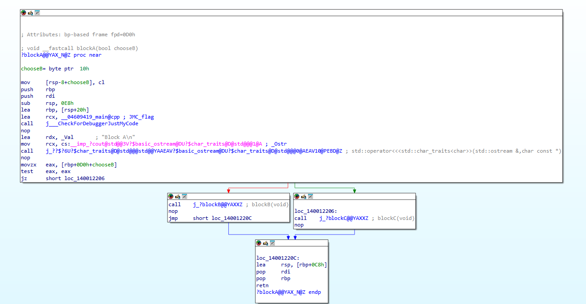
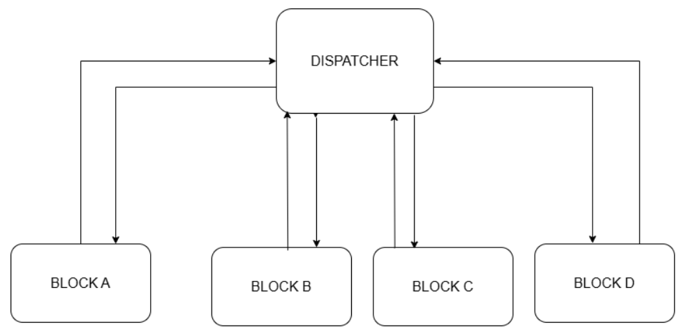
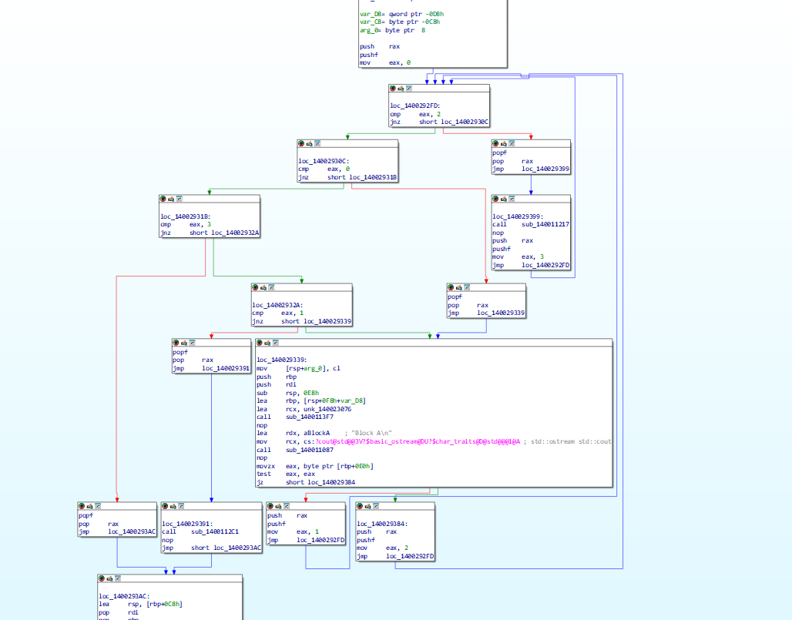
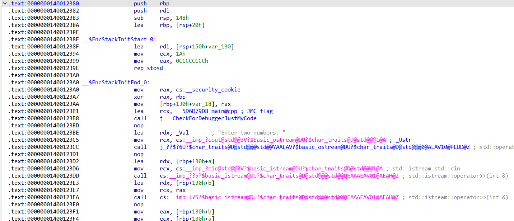
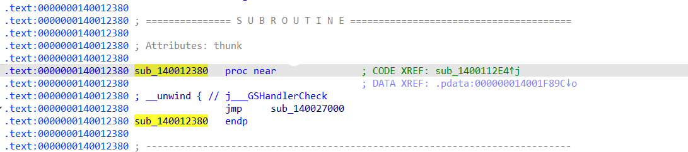
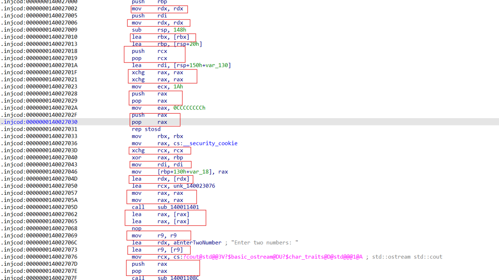

# ObfuGuard

**Windows PE binary obfuscation tool** for research and software protection.

ObfuGuard transforms compiled 64-bit (and, for junk mode, 32-bit) Portable Executable files at the machine-code level. It increases reverse-engineering cost while aiming to preserve program behavior. It needs a matching **PDB** for function discovery.

| | |
|---|---|
| **Version** | 4.1.x |
| **License** | MIT |
| **Platform** | Windows x64 (MSVC v143 / VS 2022) |
| **Author** | [sondt99](https://github.com/sondt99) |

---

## Features

| Mode | What it does | PE arch |
|------|----------------|---------|
| **Control Flow Flattening (CFF)** | Basic blocks → shuffled dispatcher state machine (`rax` / flags preserved) | **64-bit only** |
| **Junk Code + Trampoline** | Relocate functions to new sections; trampoline + neutral junk at original RVA | **32-bit and 64-bit** |

Also included:

- Shared **function discovery** (`PE + PDB`) for both modes  
- **Blacklist** of CRT/runtime symbols (file-configurable + built-in defaults)  
- Jump-table detection (CFF skips unsafe functions)  
- Section-limit awareness for junk injection  
- Benchmark and behavioral test suite under `benchmark/` and `binary_test/`  
- Hardened PE parsing, CFG/CET-friendly build flags (see `CHANGELOG.md`)

---

## Requirements

- **Windows 10/11** (x64)  
- **Visual Studio 2022** — Desktop development with C++ (MSVC v143)  
- **[vcpkg](https://github.com/microsoft/vcpkg)** integrated with VS  
- Target **`.exe` + matching `.pdb`** (same directory / name when possible)

### Libraries (vcpkg)

```powershell
vcpkg install capstone:x64-windows
vcpkg install keystone:x64-windows
vcpkg install lief:x64-windows
vcpkg install asmjit:x64-windows
vcpkg install zydis:x64-windows
```

| Library | Role |
|---------|------|
| Zydis | Disassembly (CFF) |
| AsmJit | Code generation helpers (CFF) |
| Capstone | Disassembly + reloc (junk) |
| Keystone | Assemble junk snippets |
| LIEF | PE rewrite (junk) |
| DbgHelp | PDB symbols (Windows SDK) |

---

## Build

```powershell
git clone https://github.com/sondt99/ObfuGuard.git
cd ObfuGuard
# Open ObfuGuard.sln → Configuration: Release | Platform: x64 → Build
```

Output: `x64\Release\ObfuGuard.exe` (plus dependency DLLs from vcpkg app-local copy).

Full steps: [docs/installation.md](docs/installation.md).

---

## Quick start

```powershell
.\x64\Release\ObfuGuard.exe
```

```
========================================
         ObfuGuard Tool - sondt
========================================

Select obfuscation mode:
  1. Control Flow Flattening
  2. Insert Junk Code - Trampoline
  0. Exit
```

1. Choose **1** (CFF) or **2** (junk).  
2. Enter the path to the PE (quotes allowed for drag-and-drop).  
3. For junk mode, choose **auto** or **manual** function selection.  
4. Output is written next to the input:
   - CFF → `name.cff.exe`  
   - Junk → `name.junk.exe`

Detailed walkthrough: [docs/user-guide.md](docs/user-guide.md).

---

## How it works (high level)

```
  target.exe + target.pdb
            │
            ▼
   FunctionDiscovery  ──► PE (pe64) + PDB (DbgHelp)
            │
            ▼
   FunctionFilter     ──► size + blacklist (CRT / runtime)
            │
     ┌──────┴──────┐
     ▼             ▼
  CFF engine    Junk / trampoline
  (Zydis)       (Capstone + Keystone + LIEF)
     │             │
     ▼             ▼
  .0Cff section  per-function sections + trampolines
     │             │
     └──────┬──────┘
            ▼
     *.cff.exe / *.junk.exe
```

### Control Flow Flattening

1. Discover and filter functions.  
2. Disassemble with Zydis; split basic blocks.  
3. Shuffle blocks; build a **dispatcher** using a state in `eax`/`rax` and `pushf`/`popf`.  
4. Relocate flattened code into a new **`.0Cff`** section; leave `jmp` stubs in `.text`.  
5. Optionally encode entry-point metadata for research entry-point tricks.

### Junk + trampoline

1. Discover and filter functions (auto: size-sorted; manual: interactive).  
2. Cap how many functions run by PE **section limit** (~96 with safety margin).  
3. Relocate each body (prefer **PDB size**, not first-`RET` only).  
4. Patch original site with junk + **`jmp rel32`** trampoline.  
5. **One** LIEF layout build for the batch (performance).

Technical detail: [docs/control-flow-flattening.md](docs/control-flow-flattening.md), [docs/junk-code-injection.md](docs/junk-code-injection.md).

---

## Proof of concept

### CFF

| Before | Target | After (IDA CFG) |
|--------|--------|-----------------|
|  |  |  |

### Junk / trampoline

| Before | Trampoline site | Relocated + junk |
|--------|-----------------|------------------|
|  |  |  |

---

## Project layout

```
ObfuGuard/
├── ObfuGuard.sln
├── ObfuGuard/                 # C++20 tool sources
│   ├── main.cpp               # CLI
│   ├── constants.h
│   ├── blacklist_default.txt
│   ├── common/                # FunctionDiscovery, FunctionFilter, FunctionInfo
│   ├── pe/                    # pe64 manual PE map + section create
│   ├── pdbparser/             # DbgHelp PDB
│   ├── obfuscatecff/          # CFF engine
│   ├── cfflattening/          # Flattening algorithm
│   ├── junkcode/              # TrampolineInjector + JunkCodeManager
│   └── func2rva/              # Interactive RVA helpers
├── binary_test/               # ~60 programs + auto_test / match_check
├── benchmark/                 # Static / runtime / RE-time scripts
├── docs/                      # Full documentation
├── PoC/                       # Screenshots
├── CHANGELOG.md
└── SECURITY.md
```

Architecture: [docs/architecture.md](docs/architecture.md).

---

## Documentation

| Doc | Description |
|-----|-------------|
| [docs/README.md](docs/README.md) | Doc index |
| [Overview](docs/overview.md) | Goals, scope, features |
| [Installation](docs/installation.md) | VS, vcpkg, build |
| [User guide](docs/user-guide.md) | CLI usage |
| [CFF](docs/control-flow-flattening.md) | Flattening pipeline |
| [Junk code](docs/junk-code-injection.md) | Trampoline + junk |
| [Architecture](docs/architecture.md) | Modules and data flow |
| [API reference](docs/api-reference.md) | Public classes / APIs |
| [Testing](docs/testing.md) | `binary_test` suite |
| [Benchmarking](docs/benchmarking.md) | Evaluation scripts |
| [FAQ](docs/faq.md) | Troubleshooting |

---

## Testing

```powershell
cd binary_test
# Optional: $env:OBFUGUARD_EXE = "D:\path\to\ObfuGuard.exe"
python auto_test.py      # run CFF + junk on suite
python match_check.py    # compare stdout vs original
```

Paths are repo-relative; override with `OBFUGUARD_EXE`. Details: [docs/testing.md](docs/testing.md).

---

## Security & ethics

- Use only on binaries you own or are authorized to modify.  
- Obfuscated PE files may trigger AV/EDR false positives.  
- Do not use ObfuGuard to hide malware.  

Reporting: [SECURITY.md](SECURITY.md).

---

## Changelog

See [CHANGELOG.md](CHANGELOG.md) (Semantic Versioning). Recent highlights (v4.x):

- Symmetric discovery/filter pipeline for CFF and junk  
- Safer PE validation and section creation  
- PDB-sized junk relocation; batch LIEF rebuild  
- Configurable blacklist file + CFF eligibility filtering  

---

## License

MIT License — Copyright (c) 2025 Thai Son Dinh (sondt). See [LICENSE](LICENSE).
